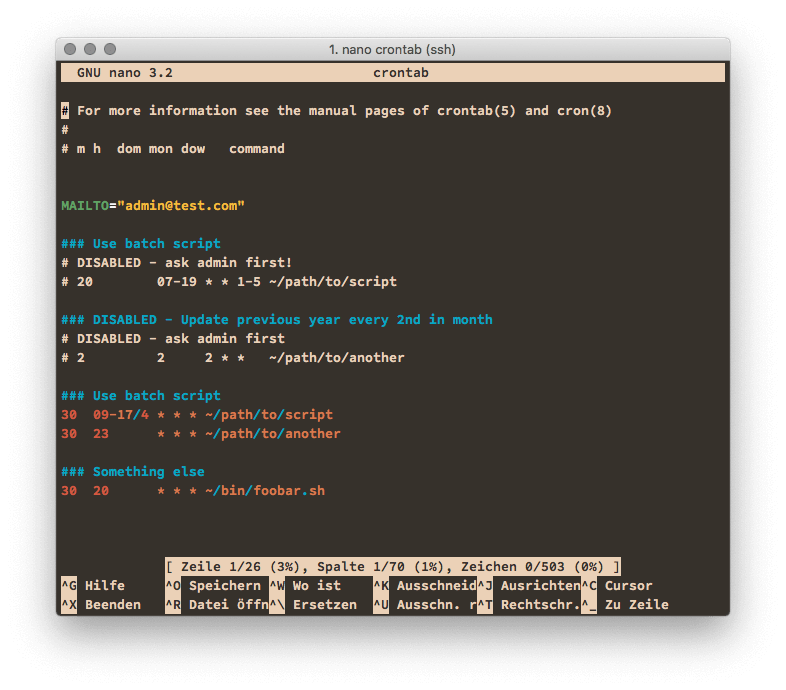

# conf · Nano Syntax Highlighting File

**Catch-all syntax for configuration files**

This syntax highlighting has been originally provided by *sas* on ArchLinux [here](https://bbs.archlinux.org/viewtopic.php?pid=1041217#p1041217) and [updated on 2012-01-28]( https://bbs.archlinux.org/viewtopic.php?pid=1048914#p1048914).

## Supported extensions and dotfiles:

**dot** `conf|config|cfg|cnf|rc|lst|list|defs|ini|desktop|mime|types|preset|cache|seat|service|htaccess`

**specials**

`\w*crontab|mirrorlist|group|hosts|passwd|rpc|netconfig|shadow|fstab|inittab|inputrc|protocols|sudoers`

…and also `conf.d/|.config`


## Installation

First, clone the repo. Copy the **conf.nanorc** into your `~/.nano/` directory.

```
$ git clone https://github.com/tomkyle/nanorc-conf.git
$ cp nanorc-brewfile/conf.nanorc ~/.nano/
```

Second, add the file to your **~/.nanorc** configuration file 

```
## conf files
include "~/.nano/conf.nanorc"
```


## Example: crontab



